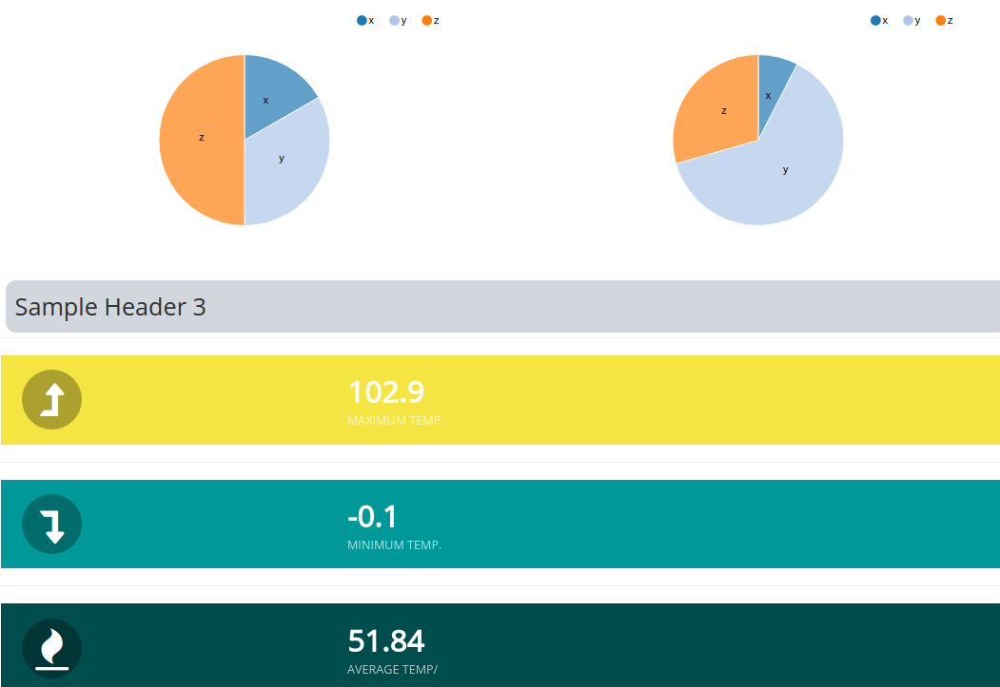

# React Climate Dashboard



## About
This is the Redux Dashboard using React/Redux by [Big-Silver].

## Features
* NVD3 Components
* HTML Components
* Choropleth Mapping in geoJson and topoJson
* Custom Filtering
* Custom Data Handling
* CSV Integration
* DKAN API Integration

## Quick Start
To set up the example project locally
```
https://github.com/Big-Silver/Redux-Climate-Dashboard.git
cd Redux-Climate-Dashboard
npm install
npm run start
```
* Visit localhost:3000 on your system


